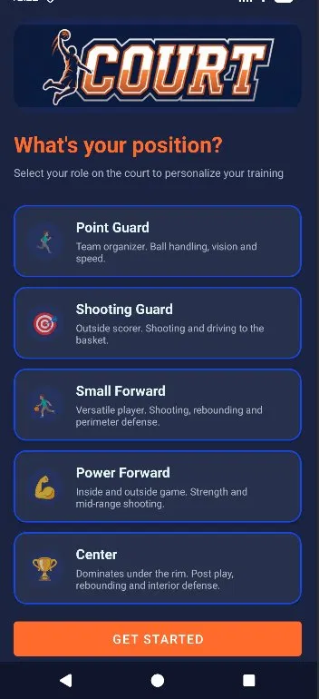
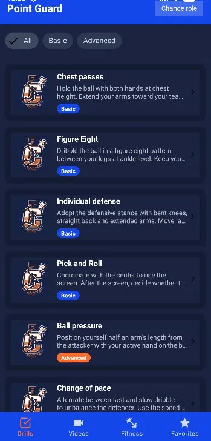
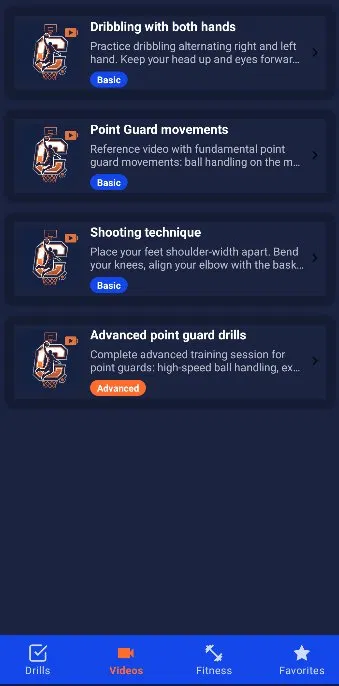

<div align="center">
  

# Court

**Aplicación Android para jugadores de baloncesto de todos los niveles**


</div>

---

## ¿Qué es Court?

Court es una aplicación móvil Android pensada para jugadores de baloncesto de cualquier nivel — desde jugadores de calle hasta competición federada. Proporciona ejercicios técnicos y vídeos de entrenamiento organizados por posición en cancha, con seguimiento de progreso y sistema de favoritos.

## Capturas de pantalla

<div align="center">
  
  
  
</div>

## Descarga

Descarga la última versión desde la [sección Releases](../../releases) e instálala en tu dispositivo Android.

> ⚠️ Es posible que necesites activar **"Instalar aplicaciones de orígenes desconocidos"** en los ajustes de tu dispositivo.

## Funcionalidades

- 🏀 **5 posiciones** — Base, Escolta, Alero, Ala-pívot, Pívot
- 📋 **Drills** — ejercicios básicos y avanzados por posición con filtros
- 🎥 **Vídeos** — contenido técnico específico por posición
- 💪 **Fitness** — entrenamiento físico (salto, fuerza y resistencia)
- ⭐ **Favoritos** — guarda ejercicios y vídeos para acceder rápido
- ✅ **Completados** — marca ejercicios como realizados y sigue tu progreso
- 🌙 **Modo oscuro** — soporte completo de tema claro y oscuro
- 🌍 **Multiidioma** — disponible en español e inglés

## Stack tecnológico

| Componente | Tecnología |
|---|---|
| Lenguaje | Java 17 |
| Arquitectura | MVVM |
| Base de datos | Room (SQLite) |
| Entidades | Rol, Ejercicio, Video, Favorito, Completado |
| UI | Fragments + Navigation Component + Material 3 |
| Imágenes | Glide |
| CI/CD | GitHub Actions |

## Instalación para desarrollo

### Requisitos

- Android Studio Hedgehog (2023.1.1) o superior
- JDK 17
- Android SDK API 24+

### Pasos

```bash
git clone https://github.com/MarcosMartinezVijuesca/Court.git
cd Court
```

Abre el proyecto con Android Studio y ejecuta en emulador o dispositivo físico con `Shift+F10`.

## Arquitectura

El proyecto sigue el patrón **MVVM** (Model-View-ViewModel) con las siguientes capas:

```
com.court.app/
├── data/
│   ├── model/        ← Entidades Room (Rol, Ejercicio, Video, Favorito, Completado)
│   ├── db/           ← DAOs + CourtDatabase
│   └── repository/   ← Repositorios (fuente única de verdad)
├── ui/
│   ├── roles/        ← Onboarding — selección de rol
│   ├── ejercicios/   ← Lista y detalle de ejercicios (Drills)
│   ├── videos/       ← Sección de vídeos técnicos
│   ├── fitness/      ← Entrenamiento físico general
│   └── favoritos/    ← Ejercicios y vídeos guardados
└── viewmodel/        ← ViewModels con LiveData
```

Ver la [Wiki](../../wiki) para el diagrama E/R y la arquitectura MVVM completos.

## Tests

El proyecto incluye tests automatizados ejecutados en cada Pull Request via GitHub Actions:

- **Tests unitarios** — JUnit con Room en memoria (RolDao, EjercicioDao, FavoritoDao)
- **Tests de UI** — Espresso (OnboardingTest, MainActivityTest)

```bash
# Ejecutar tests unitarios
./gradlew test

# Ejecutar tests de instrumentación
./gradlew connectedAndroidTest
```

## Flujo de trabajo Git

Este proyecto sigue [Conventional Commits](https://www.conventionalcommits.org/) y Git Flow:

```bash
# Nueva funcionalidad
git checkout -b feature/nombre-feature
git commit -m "feat: descripción del cambio"
git push origin feature/nombre-feature
# Abrir Pull Request → develop
```

| Prefijo | Uso |
|---|---|
| `feat:` | Nueva funcionalidad |
| `fix:` | Corrección de bug |
| `docs:` | Documentación |
| `refactor:` | Mejora sin cambiar comportamiento |
| `test:` | Tests |
| `chore:` | Mantenimiento |

Ver la [Guía de contribución](../../wiki/Guia-de-contribucion).

## Autor

**Marcos Martínez Vijuesca**  
TFG — Desarrollo de Aplicaciones Multiplataforma  
Centro San Valero · 2025

## Licencia

MIT License — ver [LICENSE](LICENSE)